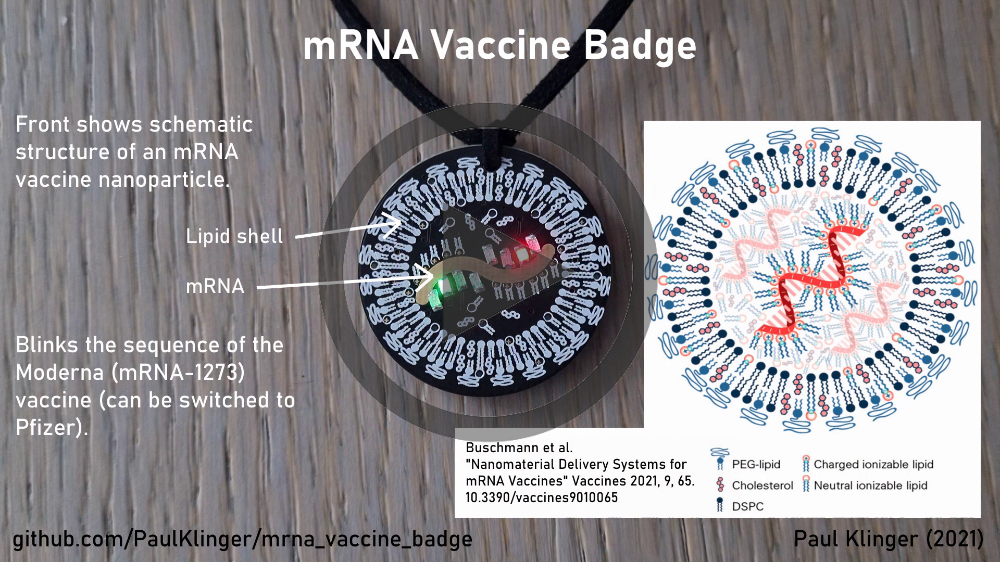

# mRNA vaccine badge

A small badge showing a schematic of an mRNA vaccine nanoparticle and blinking the RNA sequence of the Moderna or Pfizer vaccines. (Switch between vaccines by long pressing (>1s) the button to enter the menu, short pressing to switch, and long pressing to save).

The RNA for the moderna vaccine is from is from https://github.com/NAalytics/Assemblies-of-putative-SARS-CoV2-spike-encoding-mRNA-sequences-for-vaccines-BNT-162b2-and-mRNA-1273 with an added poly-A tail of similar length to the Pfizer one (just a guess). The Pfizer sequence is from https://berthub.eu/articles/11889.doc

The sequences are stored encoded into 2 bits per nucleotide using [encode_genome.py](encode_genome.py).

Current draw is ~3mA depending on which color LEDs are active at the moment (the blue ones are a lot more efficient than the red ones). A CR2032 coin cell should last for at least 10h of continuous use (one run through the sequence takes ~10min, and it automatically shuts off afterwards).
Standby current draw is ~0.15µA, should last basically forever (years).

### Components:

- 1 x ATtiny1617 MCU
- 1 x SMD button (SMD-BUTTON(2P-3.0X2.5X1.2+0.4MM)-B3U-1000P-2P-SMD)
- 1 x CR2032 Coin cell clip
- 2 x blue 0805 LED
- 2 x green 0805 LED
- 2 x yellow 0805 LED
- 2 x red 0805 LED
- 2 x 2.2kΩ 0805 resistor (for green LEDs)
- 2 x 910Ω 0805 resistor (for blue LEDs)
- 2 x 470Ω 0805 resistor (for red LEDs)
- 2 x 240Ω 0805 resistor (for yellow LEDs)

There's a footprint for a ceramic capacitor, but it's not needed and I had issues with leakage current with cheap chinese ones (even 1µA really hurts the standby lifetime). 

(The one in the video has wrong (lower) resistor values, which burns a lot more power for negligible increase in brightness.)